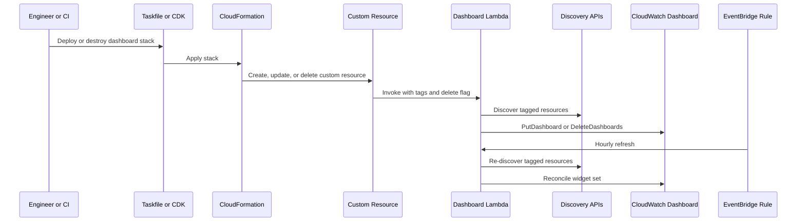

---
owners:
  - jozef-reisinger
owners-verified-date: 2026-04-15
next-review-date: 2026-07-15
contributors:
  -

---

# Metrics Domain Architecture

## Related ADO Work Items

- **Feature(s):**
  - [Feature 906687: SaaS Observability Plane: Technical Logs, Metrics and Alerting](https://dev.azure.com/cmd-sw/dd842fe3-f288-46de-934e-b7a7aa42b2e1/_workitems/edit/906687)
- **User Story(s):**
  - [User Story 910422: Dashboards for Metrics](https://dev.azure.com/cmd-sw/dd842fe3-f288-46de-934e-b7a7aa42b2e1/_workitems/edit/910422)

## Overview

This document is intentionally narrow. It describes only the dashboard
capability delivered by User Story `910422`.

The Observe Plane metrics domain currently manages CloudWatch dashboards for
tagged CMD SaaS resources.

This document describes what exists. The decision record for why this pattern
was chosen lives in
[`001-adr-dynamic-dashboard-management.md`](./adr/001-adr-dynamic-dashboard-management.md).

## Scope

### In scope

- metrics dashboards in Observe Plane
- dashboard scoping by `environment` and optional `tenant-code`
- deploy-time and scheduled reconciliation

### Out of scope

- logs
- alerting policy
- synthetic monitoring
- traces
- tenant-facing product dashboards

## Runtime Flow

The dashboard manager is an internal observability component. It does not expose
a public API. CDK provisions the dashboard manager, a custom resource invokes it
during stack lifecycle changes, and EventBridge refreshes the same logic later.
The Lambda discovers tagged resources and reconciles the CloudWatch dashboard.

## Source of Truth

- **Stack definition**
  - [`../../infra/metrics/dashboard/stacks/dashboard.ts`](../../infra/metrics/dashboard/stacks/dashboard.ts)
  - [`../../infra/metrics/dashboard/constructs/lambda.ts`](../../infra/metrics/dashboard/constructs/lambda.ts)
- **Runtime**
  - [`../../metrics/dashboard/lambda/handler/handler.go`](../../metrics/dashboard/lambda/handler/handler.go)
  - [`../../metrics/dashboard/dashboard.go`](../../metrics/dashboard/dashboard.go)
  - [`../../metrics/dashboard/metrics.go`](../../metrics/dashboard/metrics.go)
- **Operations**
  - [`../../metrics/dashboard/README.md`](../../metrics/dashboard/README.md)
- **Decision**
  - [`./adr/001-adr-dynamic-dashboard-management.md`](./adr/001-adr-dynamic-dashboard-management.md)

## Notes

- The dashboard exists immediately after deployment because reconciliation runs
  during CloudFormation operations.
- The dashboard is eventually consistent after that because EventBridge refreshes
  it on a schedule.
- Tagging is part of the contract. If resource tags change, dashboard content
  changes too.
